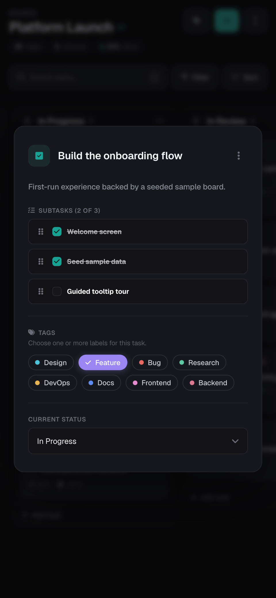

# Cadence

**Cadence** is a fullstack Kanban board for daily task management — organize work across multiple boards, columns and tasks, with drag-and-drop, subtasks, color labels, due dates and light/dark themes.

This repository is the **frontend** (Next.js). It talks to a separate **Laravel API** ([kanban-api](https://github.com/maricastroc/cadence-api)) over HTTP, with authentication handled by a secure **httpOnly session cookie**.

🔗 **Live demo:** [cadence.marianacastro.dev](https://cadence.marianacastro.dev/) — click **"Explore the demo"** on the login page to jump straight in, no sign-up required.

---

## ✨ Features

**Boards & workflow**
- Create, edit and delete boards, and switch the active board
- Customize each board's workflow columns — add, rename and remove (up to 6)
- Reorder columns by drag-and-drop, with optimistic updates and rollback on failure
- Each board gets a deterministic accent color for quick visual identity

**Tasks**
- Create, edit and delete tasks with title, description and due date
- Subtasks: add, remove, toggle completion and reorder (animated)
- Due-date status badges (overdue / due soon / completed), derived from the date and subtask progress
- Drag and drop to move tasks across columns or reorder within a column — optimistic, with rollback if the request fails

**Labels**
- Create, edit and delete color-coded labels, with per-board usage counts
- Assign multiple labels to a task

**Productivity**
- Search tasks, filter by label, and sort (manual / due date / name)
- Keyboard shortcuts: `/` focuses search, `⌘/Ctrl + ↵` submits a task form, `Esc` closes menus/dialogs

**Experience**
- Responsive layout with a collapsible sidebar and a mobile "boards" sheet
- Light / dark theme toggle (persisted)
- Client-side form validation on every create/edit flow (Zod)

**Auth**
- Register, login and logout, with route guards
- **One-click demo** — "Explore the demo" signs you into a shared demo account whose sample workspace is reseeded on every entry, so visitors can try the app without signing up
- Session stored in an **httpOnly cookie** that JavaScript can't read — see [Authentication](#-authentication)

---

## 🖼️ Screenshots

<table>
  <tr>
    <td align="center" width="62%"><strong>Desktop</strong></td>
    <td align="center" width="38%"><strong>Mobile</strong></td>
  </tr>
  <tr>
    <td valign="top"></td>
    <td rowspan="2" valign="top"></td>
  </tr>
  <tr>
    <td valign="top"></td>
  </tr>
</table>

---

## 🧱 Tech Stack

**Frontend (this repo)**
- [Next.js 14](https://nextjs.org/) (Pages Router) · [React 18](https://react.dev/) · [TypeScript](https://www.typescriptlang.org/)
- [styled-components](https://styled-components.com/) for styling and theming
- [SWR](https://swr.vercel.app/) + [Axios](https://axios-http.com/) for data fetching
- [React Hook Form](https://react-hook-form.com/) + [Zod](https://zod.dev/) for forms and validation
- [dnd kit](https://dndkit.com/) for drag-and-drop — tasks, columns and subtask reordering
- [Radix UI](https://www.radix-ui.com/) primitives (dialog, switch, visually-hidden) + [Font Awesome](https://fontawesome.com/)
- [react-hot-toast](https://react-hot-toast.com/) for notifications
- [Vitest](https://vitest.dev/) + [Testing Library](https://testing-library.com/) for tests
- ESLint + Prettier

**Backend ([kanban-api](https://github.com/maricastroc/kanban-api))**
- [Laravel 12](https://laravel.com/) + [Sanctum](https://laravel.com/docs/sanctum), on PostgreSQL
- Deployed on Railway (`api.marianacastro.dev`)

---

## 🏛️ Architecture

The app is split into two deployments:

```
Browser ──> kanban.marianacastro.dev   (Next.js · Vercel)        ← this repo
   │
   └── XHR (withCredentials) ──> api.marianacastro.dev   (Laravel · Railway)   ← kanban-api
```

The API is served from a **subdomain of the frontend's domain**, so both are *same-site*. That lets the auth cookie use `SameSite=Lax` and stay reliable across browsers (Safari included).

### 🔐 Authentication

Auth uses a **Sanctum token carried in an httpOnly cookie** — the token is never exposed to JavaScript, which mitigates token theft via XSS.

1. On **login/register**, the API issues a Sanctum token and sets it as an `httpOnly` cookie (`SameSite=Lax`, `Secure` in production).
2. On every request, Axios sends the cookie (`withCredentials: true`); a backend middleware promotes it to an `Authorization: Bearer` header so Sanctum authenticates it transparently.
3. The frontend never reads the token. It determines whether it's authenticated by probing `GET /user` through the `useAuthUser` hook (consumed by the route guards and the boards context).
4. **Logout** calls the API, which clears the cookie.

---

## 🚀 Getting Started

### Prerequisites
- [Node.js 22+](https://nodejs.org/) and npm
- The **API must be running** — authenticated features need the backend. Run [kanban-api](https://github.com/maricastroc/kanban-api) locally, or point at the deployed API.

> ⚠️ Because auth is a `SameSite=Lax` cookie, a frontend on `localhost` **cannot** authenticate against the production API at `api.marianacastro.dev` (that's cross-site, so the cookie isn't sent). For authenticated local development, run the API locally too — see the note in [kanban-api](https://github.com/maricastroc/kanban-api).

### 1. Clone & install
```bash
git clone https://github.com/maricastroc/cadence-app
cd cadence-app
npm install
```

### 2. Configure the environment
Copy the example file and adjust the API URL:
```bash
cp .env.example .env.local
```
```bash
# .env.local — point at your local API
NEXT_PUBLIC_API_URL=http://localhost:8000/api/
```

### 3. Run
```bash
npm run dev
```
Open [http://localhost:3000](http://localhost:3000).

---

## 🧪 Testing

Unit and component tests with [Vitest](https://vitest.dev/) + [Testing Library](https://testing-library.com/), focused on the logic most likely to regress:

- **Drag-and-drop engine** (`useDragAndDrop`) — cross-column moves, within-column and column reordering, the move-vs-reorder persistence calls, and rollback when a request fails
- **Utilities** — due-date status, date formatting, board/column filtering, deterministic board colors, tag colors and API-error handling
- **Form & UI flows** — login/register validation, the password field, and the delete-confirmation dialog

Coverage is collected for `src/hooks` and `src/utils`.

```bash
npm test            # run the suite once
npm run test:watch  # watch mode
npm run test:coverage
```

---

## 📦 Scripts

| Script | Description |
| --- | --- |
| `npm run dev` | Start the development server |
| `npm run build` | Production build |
| `npm start` | Serve the production build |
| `npm run lint` | Run ESLint |
| `npm test` | Run the test suite |
| `npm run test:watch` | Run tests in watch mode |
| `npm run test:coverage` | Run tests with coverage |

---

## 📝 Engineering decisions

A few decisions worth calling out:

- **Decoupled SPA + REST API** (Next.js ↔ Laravel/Sanctum) rather than a monolith — which meant owning the cross-origin surface: CORS, credentialed requests and cookie behavior.
- **Auth in an httpOnly cookie instead of a localStorage token**, so the token is never reachable from JavaScript (XSS can't steal it). The trade-off — cookies aren't sent cross-site — is resolved by serving the API from a subdomain, keeping it *same-site* so a `SameSite=Lax` cookie works across Vercel + Railway.
- **Optimistic drag-and-drop** for tasks and columns: the UI updates immediately and reconciles with the server, rolling back to the pre-drag snapshot if the request fails. Drag targets are stable string ids (`task-<id>` / `column-<id>`), not array positions, so reordering or filtering can't desync the drop target.
- **React Context + SWR** for state: SWR owns server data and revalidation, Context holds the active-board selection — separating "what the server says" from "what the user is looking at".
- A substantial **refactor pass**: extracting reusable hooks and components, removing dead code and de-duplicating the codebase.

---

## 📄 License

Released under the [MIT License](LICENSE). You're free to use, study, fork and build on this code — **as long as the original copyright and license notice are kept**. Reuse it and learn from it; don't strip the attribution and present it as your own.

© 2025–2026 Mariana Castro
